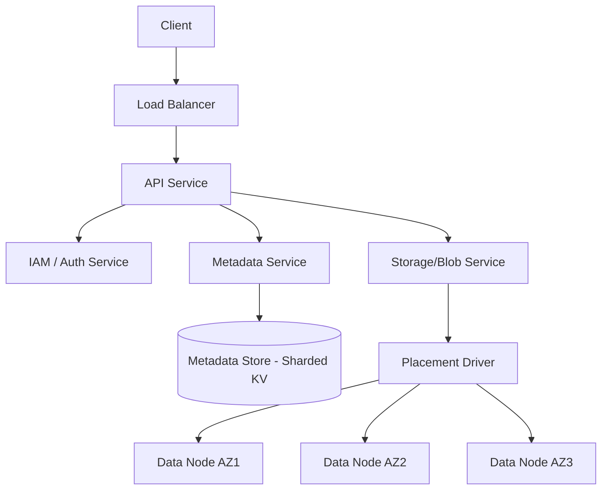

# Design AWS S3 (Object Storage)

## ⏱️ 1. The 2-Minute Version

**Goal**: Design a highly durable (11 9s), scalable, and available object storage service like AWS S3 or Google Cloud Storage that stores unstructured data (images, videos, backups).

**Key Components**:
1.  **API Gateway**: Handles REST API requests (PUT, GET, DELETE).
2.  **Metadata Service**: Manages object metadata (name, size, permissions, location) using a sharded Key-Value store.
3.  **Blob Storage (Block Store)**: Stores the actual data chunks using **Erasure Coding** for durability.
4.  **Placement Driver**: Decides where to store data to ensure resilience across Availability Zones (AZs).

**Key Challenges**:
-   **Durability**: How to ensure we never lose data (99.999999999% durability). **Erasure Coding** is key here (better than 3x replication).
-   **Consistency**: Modern S3 is strongly consistent. This requires atomic updates to metadata.
-   **Scalability**: Handling billions of small objects vs. huge files. Flat namespace (Buckets) vs. Hierarchy.

**Trade-offs**:
-   **Erasure Coding vs Replication**: EC saves storage (1.5x overhead vs 3x for replication) but uses more CPU for calculation and repair.
-   **Strong vs Eventual Consistency**: S3 moved from Eventual to Strong (2020), simplifying app development at the cost of higher internal latencies/complexity for metadata updates.

---

## 🏗️ 2. The 10-Minute Structured Version

### Requirements

#### Functional
-   **Buckets**: Logical containers for objects.
-   **Objects**: Immutable files (up to 5TB).
-   **Operations**: `putObject`, `getObject`, `deleteObject`, `listObjects`.
-   **Versioning**: Keep history of overwrites.
-   **Lifecycle Management**: Move to cheaper storage (Glacier) automatically.

#### Non-Functional
-   **Durability**: 11 9s (1 in 100 billion objects lost).
-   **Availability**: 99.99%.
-   **Throughput**: Scale to support massive parallel uploads/downloads.
-   **Consistency**: Strong read-after-write consistency.

### Capacity Estimation
-   **Scale**: 500 EB (Exabytes) total storage.
-   **Object Count**: 1 Trillion objects.
-   **Metadata**: 1KB per object -> 1 PB of *metadata* alone. This means metadata must be sharded.

### High-Level Architecture

### Data Flow: PUT Object (Strong Consistency)
1.  **Request**: Client sends `PUT /bucket/photo.jpg`.
2.  **Auth**: IAM checks permissions.
3.  **Stream Data**: Request forwarded to **Storage Service**.
4.  **Erasure Coding**: Data stream is split into shards (e.g., 6 data + 3 parity) in memory.
5.  **Write**: Shards are written to Data Nodes across 3 AZs.
6.  **Commit**: Once durability quorum is met (e.g., 8/9 shards written), **Metadata Service** is called.
7.  **Atomic Update**: Metadata adds entry `photo.jpg -> [shard_locations]`. This is the commit point.
8.  **Success**: 200 OK returned to client. Subsequent GETs see the new file immediately.

---

## 🧠 3. Deep Dive & Technical Details

### 1. Durability: Erasure Coding (EC)
Storing 3 copies of 500 Exabytes is too expensive (1500 EB total).
**Erasure Coding** (Reed-Solomon) allows recovering data with less overhead.

**Example (6+3)**:
-   Split object into 6 data chunks.
-   Calculate 3 parity chunks.
-   Total 9 chunks. Store on 9 different disks across 3 AZs.
-   **Storage Overhead**: 1.5x (compared to 3.0x for replication).
-   **Recovery**: Can lose ANY 3 drives/nodes and still recover the file.

### 2. The Metadata Bottleneck (Scaling S3)
A single DB cannot hold metadata for 1 Trillion objects.
**Partitioning**:
-   **Bucket Partitioning**: Not enough. Large buckets cause hot partitions.
-   **Key Partitioning**: Range-based partitioning on object keys (e.g., "a"..."c").
-   **Dynamic Splitting**:
    -   Initially one partition for `bucket-1`.
    -   As `bucket-1` grows or gets high IOPS, split metadata partition into `bucket-1 (a-m)` and `bucket-1 (n-z)`.
    -   This explains why S3 previously warned against sequential prefixes (like timestamps) creating hotspots.

### 3. Strong Consistency
Old S3 was eventually consistent. New S3 is strong.
**How**:
-   **Write-Path**: Data is written *before* metadata is updated.
-   **Metadata Lock/Version**: The metadata transaction is the single source of truth.
-   **Cache Invalidation**: On write, any caching layers (internal lookups) must be invalidated or bypassed.

### 4. Multipart Uploads
For large files (e.g., 100GB):
-   Client chunks file into 10 MB parts.
-   Uploads parts in parallel: `UploadPart(UploadId, PartNumber, Data)`.
-   S3 stores parts in temporary space.
-   `CompleteMultipartUpload` call instructs S3 to stitch them together into one logical object (metadata operation only, no data movement).

### 5. Storage Tiers (Hot vs Cold)
-   **Standard**: SSD/Fast HDD. Instant access.
-   **IA (Infrequent Access)**: Cheaper, retrieval fee.
-   **Glacier**: Tape/Cold HDD. very cheap, minutes/hours to retrieve.
-   **Lifecycle Policies**: Background jobs scan metadata (bucket scans) and move/delete objects based on age.

---

## ⚖️ 4. Trade-offs & Alternatives

1.  **Block Storage (EBS) vs Object Storage (S3)**:
    -   **EBS**: Low latency (IOPS), mountable as disk, mutable.
    -   **S3**: High throughput, HTTP API, immutable objects, scalable capacity.

2.  **Flat Namespace vs Hierarchy**:
    -   S3 is a Map `Key -> Value`. Virtual folders `folder/file.txt` are just prefixes.
    -   *Renaming a folder in S3 is O(N)* (copy + delete all N objects), whereas in a file system it's O(1).

## 🔗 References
-   [AWS S3 Strong Consistency Blog](https://aws.amazon.com/blogs/aws/amazon-s3-update-strong-read-after-write-consistency/)
-   [Erasure Coding in Storage](https://www.backblaze.com/blog/reed-solomon/)
